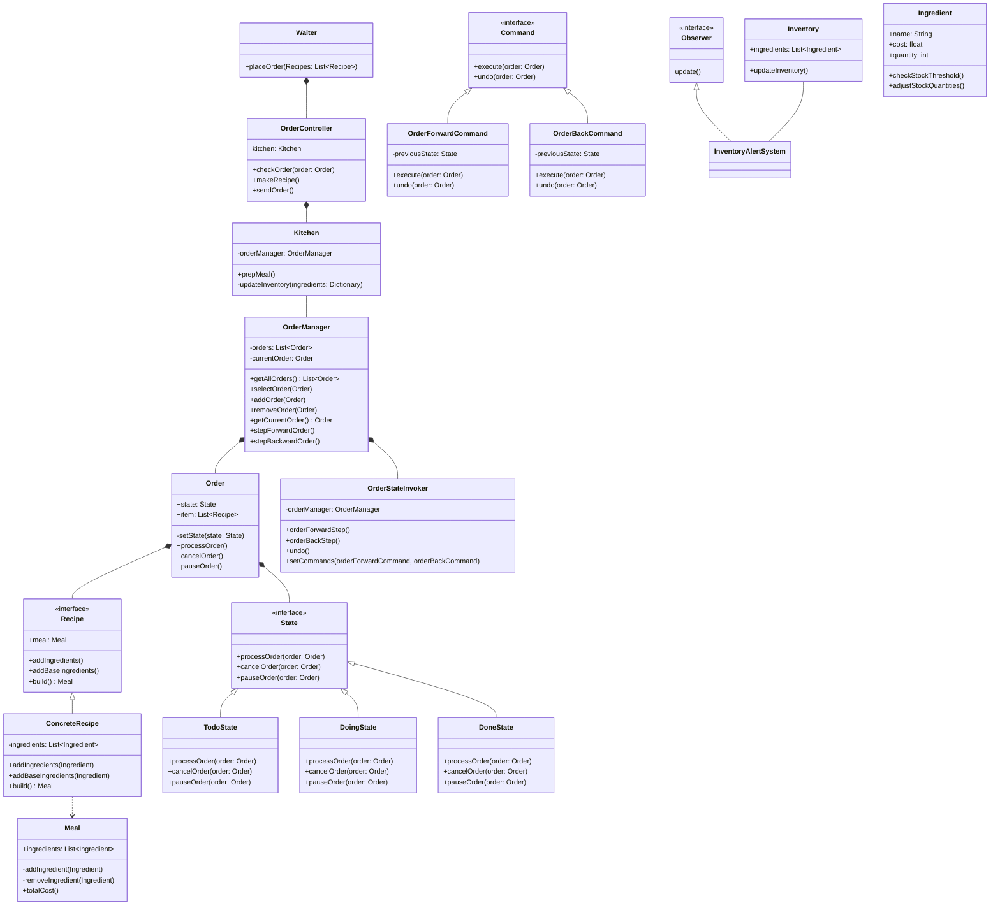

```mermaid
classDiagram
    OrderManager *-- Order
    Kitchen -- OrderManager
    Order *-- State
    Order *-- Recipe
    Waiter *-- OrderController
    OrderController *-- Kitchen
    Recipe <|-- ConcreteRecipe
    Command <|--OrderForwardCommand
    Command <|--OrderBackCommand
    OrderManager *-- OrderStateInvoker
    
    ConcreteRecipe ..> Meal
    
    Observer <|--InventoryAlertSystem
    Inventory -- InventoryAlertSystem
    
    State <|-- TodoState
    State <|-- DoingState
    State <|-- DoneState

    class Observer {
        <<interface>>
        update()
    }

    class InventoryAlertSystem {
        
    }

    class Ingredient {
        +name: String
        +cost: float
        +quantity: int 
        +checkStockThreshold()
        +adjustStockQuantities()
    }

    class Inventory {
        +ingredients: List~Ingredient~
        +updateInventory()
    }

    class OrderManager {
        -orders: List~Order~
        -currentOrder: Order
        +getAllOrders() List~Order~
        +selectOrder(Order)
        +addOrder(Order)
        +removeOrder(Order)
        +getCurrentOrder() Order
        +stepForwardOrder()
        +stepBackwardOrder()
    }

    class Kitchen {
        -orderManager: OrderManager
        +prepMeal()
        -updateInventory(ingredients: Dictionary)
    }

    class OrderStateInvoker {
        -orderManager: OrderManager
        +orderForwardStep()
        +orderBackStep()
        +undo()
        +setCommands(orderForwardCommand, orderBackCommand)
    }

    class Command {
        <<interface>>
        +execute(order: Order)
        +undo(order: Order)
    }

    class OrderForwardCommand {
        -previousState: State
        +execute(order: Order)
        +undo(order: Order)
    }

    class OrderBackCommand {
        -previousState: State
        +execute(order: Order)
        +undo(order: Order)
    }

    class Recipe {
        <<interface>>
        +meal: Meal 
        +addIngredients()
        +addBaseIngredients()
        +build() Meal
    }

    class ConcreteRecipe {
        -ingredients: List~Ingredient~
        +addIngredients(Ingredient)
        +addBaseIngredients(Ingredient)
        +build() Meal
    }

    class Meal {
        +ingredients: List~Ingredient~
        -addIngredient(Ingredient)
        -removeIngredient(Ingredient)
        +totalCost()
    }

    class Order {
        +state: State 
        +item: List~Recipe~
        
        -setState(state: State)
        +processOrder()
        +cancelOrder()
        +pauseOrder()
    }

    class State {
        <<interface>>
        +processOrder(order: Order)
        +cancelOrder(order: Order)
        +pauseOrder(order: Order)
    }

    class TodoState {
        +processOrder(order: Order)
        +cancelOrder(order: Order)
        +pauseOrder(order: Order)
    }

    class DoingState {
        +processOrder(order: Order)
        +cancelOrder(order: Order)
        +pauseOrder(order: Order)
    }

    class DoneState {
        +processOrder(order: Order)
        +cancelOrder(order: Order)
        +pauseOrder(order: Order)
    }

    class Waiter {
        +placeOrder(Recipes: List~Recipe~)
    }

    class OrderController {
        kitchen: Kitchen 
        +checkOrder(order: Order)
        +makeRecipe()
        +sendOrder()
    }

    %% class OrderPlacedEvent {
    %%     +order: Order
    %% }

    %% class MealPreparedEvent {
    %%     +order: Order
    %% }

    %% class StockThresholdReachedEvent {
    %%     +ingredient: Ingredient
    %% }

    %% class EventBus {
    %%     +publish(event: Event)
    %%     +subscribe(eventType: Class, handler: EventHandler)
    %% }

    %% class EventHandler {
    %%     +handle(event: Event)
    %% }

    %% class OrderPlacedHandler implements EventHandler {
    %%     +kitchen: Kitchen
    %%     +handle(event: OrderPlacedEvent)
    %% }

    %% class MealPreparedHandler implements EventHandler {
    %%     +orderManager: OrderManager
    %%     +handle(event: MealPreparedEvent)
    %% }

    %% class StockThresholdReachedHandler implements EventHandler {
    %%     +inventory: Inventory
    %%     +handle(event: StockThresholdReachedEvent)
    %% }

    %% This is complicating things since do we want the customer to be able to place order too? 
    %% class Customer {
    %%     +order: Order
    %%     +name: String
    %%     +contactInfo: String
    %%     +placeOrder(order: Order)
    %% }

    %% class AlertService {
    %%     <<Interface>>
    %%     +notify(event: AlertEvent)
    %% }

    %% class AlertEvent {
    %%     +message: String
    %%     +source: Object
    %% }

    %% class LowStock {
    %%     +ingredient: Ingredient
    %% }
```
