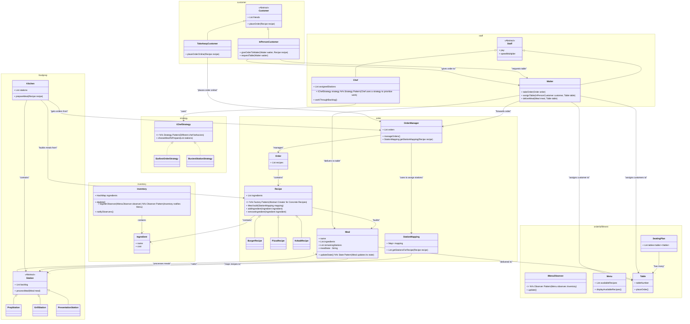

```mermaid
classDiagram

namespace order {
    class Order {
        + List<Recipe> recipes
    }
    class OrderManager {
        + List<Order> orders
        + manageOrders()
        + StationMapping getStationMapping(Recipe recipe)
    }
    class Recipe {
        <<Abstract>> %% Factory Pattern (Abstract Creator for Concrete Recipes)
        + List<Ingredient> ingredients
        + Meal build(StationMapping mapping)
        + addIngredient(Ingredient ingredient)
        + removeIngredient(Ingredient ingredient)
    }
    class BurgerRecipe
    class PizzaRecipe
    class KebabRecipe
    class Meal {
        + name
        + List<Ingredient> ingredients
        + List<Station> remainingStations
        + mealState : String
        + updateState() %% State Pattern (Meal updates its state)
    }
    class StationMapping {
        + Map<Recipe, List<Station>> mapping
        + List<Station> getStationsForRecipe(Recipe recipe)
    }
}

namespace staff {
    class Staff {
        <<Abstract>>
        + pay
        + speedMultiplier
    }
    class Waiter {
        + takeOrder(Order order)
        + assignTable(InPersonCustomer customer, Table table)
        + deliverMeal(Meal meal, Table table)
    }
    class Chef {
        + List<Station> assignedStations
        + IChefStrategy strategy %% Strategy Pattern (Chef uses a strategy to prioritize work)
        + workThroughBacklog()
    }
}

namespace foodprep {
    class Kitchen {
        + List<Station> stations
        + prepareMeal(Recipe recipe)
    }

    class Station {
        <<Abstract>>
        + List<Meal> backlog
        + processMeal(Meal meal)
    }

    class PrepStation
    class GrillStation
    class PresentationStation
}

namespace inventory {
    class Ingredient {
        + name
        + cost
    }
    class Inventory {
        + HashMap<Ingredient, int> ingredients
        + deplete()
        + registerObserver(IMenuObserver observer) %% Observer Pattern (Inventory notifies Menu)
        + notifyObservers()
    }
}

namespace orderfulfillment {
    class IMenuObserver {
        <<Interface>> %% Observer Pattern (Menu observes Inventory)
        + update()
    }
    
    class Menu {
        + List<Recipe> availableRecipes
        + displayAvailableRecipes()
    }

    class SeatingPlan {
        + List<Table> tables
    }

    class Table {
        + tableNumber
        + placeOrder()
    }
}

namespace customer {    
    class Customer {
        <<Abstract>>
        + List<Customer> friends
        + placeOrder(Recipe recipe)
    }
    class TakeAwayCustomer {
        + placeOrderOnline(Recipe recipe)
    }
    class InPersonCustomer {
        + giveOrderToWaiter(Waiter waiter, Recipe recipe)
        + requestTable(Waiter waiter)
    }
}

namespace strategy {
    class IChefStrategy {
        <<Interface>> %% Strategy Pattern (Different chef behaviors)
        + chooseMealToPrepare(List<Station> stations)
    }
    class EarliestOrderStrategy
    class BusiestStationStrategy
}

%% Relationships
Staff <|-- Waiter
Staff <|-- Chef

Customer <|-- TakeAwayCustomer
Customer <|-- InPersonCustomer

Inventory --> "*" Ingredient : contains

SeatingPlan --> "*" Table : "has many"
Waiter --> "*" Table : "assigns customers to"

Order --> "*" Recipe : "contains"
OrderManager --> "*" Order : "manages"

Recipe <|-- BurgerRecipe
Recipe <|-- PizzaRecipe
Recipe <|-- KebabRecipe

Recipe --> "*" Ingredient : "contains"
Recipe --> Meal : "builds"

OrderManager --> StationMapping : "uses to assign stations"
StationMapping --> "*" Station : "maps recipes to"

Meal --> "*" Station : "visits"
Meal --> "*" Table : "delivered to"

Waiter --> Meal : "delivers to table"

Kitchen --> OrderManager : "gets orders from"
Kitchen --> Recipe : "builds meals from"
Kitchen --> "*" Station : "contains"

%% Meal Processing
Station <|-- PrepStation
Station <|-- GrillStation
Station <|-- PresentationStation
Station --> "*" Meal : "processes meals"

%% Chef Strategy
Chef --> IChefStrategy : "uses"
IChefStrategy <|.. EarliestOrderStrategy
IChefStrategy <|.. BusiestStationStrategy

%% Customer Ordering
InPersonCustomer --> Waiter : "requests table"
Waiter --> Table : "assigns customer to"

InPersonCustomer --> Waiter : "gives order to"
Waiter --> OrderManager : "forwards order"
TakeAwayCustomer --> OrderManager : "places order online"

```