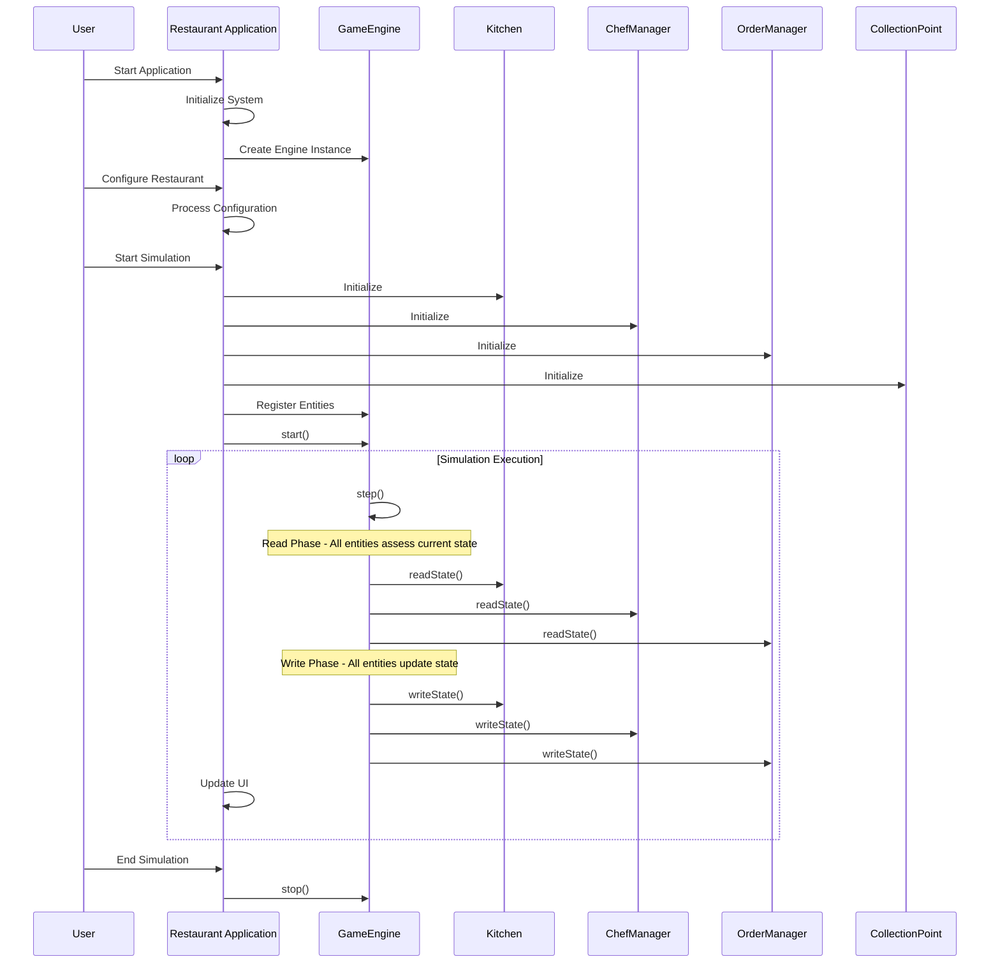

```mermaid
sequenceDiagram
    participant User
    participant Application as Restaurant Application
    participant GameEngine
    participant Kitchen
    participant ChefManager
    participant OrderManager
    participant CollectionPoint
    
    User->>Application: Start Application
    Application->>Application: Initialize System
    Application->>GameEngine: Create Engine Instance
    
    User->>Application: Configure Restaurant
    Application->>Application: Process Configuration
    
    User->>Application: Start Simulation
    
    Application->>Kitchen: Initialize
    Application->>ChefManager: Initialize
    Application->>OrderManager: Initialize
    Application->>CollectionPoint: Initialize
    
    Application->>GameEngine: Register Entities
    
    Application->>GameEngine: start()
    
    loop Simulation Execution
        GameEngine->>GameEngine: step()
        
        note over GameEngine: Read Phase - All entities assess current state
        GameEngine->>Kitchen: readState()
        GameEngine->>ChefManager: readState()
        GameEngine->>OrderManager: readState()
        
        note over GameEngine: Write Phase - All entities update state
        GameEngine->>Kitchen: writeState()
        GameEngine->>ChefManager: writeState()
        GameEngine->>OrderManager: writeState()
        
        Application->>Application: Update UI
    end
    
    User->>Application: End Simulation
    Application->>GameEngine: stop()
```