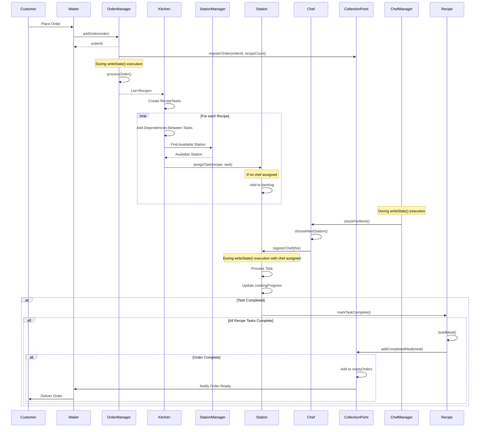

```mermaid
sequenceDiagram
  participant Customer as Customer
  participant Waiter as Waiter
  participant OrderManager as OrderManager
  participant Kitchen as Kitchen
  participant StationManager as StationManager
  participant Station as Station
  participant Chef as Chef
  participant CollectionPoint as CollectionPoint
  participant ChefManager as ChefManager
  participant Recipe as Recipe

  Customer ->> Waiter: Place Order
  Waiter ->> OrderManager: addOrder(order)
  OrderManager -->> Waiter: orderId
  OrderManager ->> CollectionPoint: registerOrder(orderId, recipeCount)
  Note over OrderManager: During writeState() execution
  OrderManager ->> OrderManager: processOrder()
  OrderManager -->> Kitchen: List<Recipe>
  Kitchen ->> Kitchen: Create RecipeTasks
  loop For each Recipe
    Kitchen ->> Kitchen: Add Dependencies Between Tasks
    Kitchen ->> StationManager: Find Available Station
    StationManager -->> Kitchen: Available Station
    Kitchen ->> Station: assignTask(recipe, task)
    Note over Station: If no chef assigned
    Station ->> Station: Add to backlog
  end
  Note over ChefManager: During writeState() execution
  ChefManager ->> Chef: checkForWork()
  Chef ->> Chef: chooseNextStation()
  Chef ->> Station: registerChef(this)
  Note over Station: During writeState() execution with chef assigned
  Station ->> Station: Process Task
  Station ->> Station: Update cookingProgress
  alt Task Completed
    Station ->> Recipe: markTaskComplete()
    alt All Recipe Tasks Complete
      Recipe ->> Recipe: buildMeal()
      Recipe ->> CollectionPoint: addCompletedMeal(meal)
      alt Order Complete
        CollectionPoint ->> CollectionPoint: Add to readyOrders
        CollectionPoint ->> Waiter: Notify Order Ready
        Waiter ->> Customer: Deliver Order
      end
    end
  end
```
